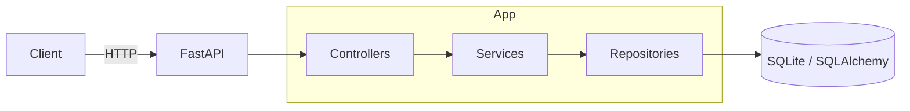

# DataConduit-API

Lightweight FastAPI service to manage data quality rules for tables and columns.

## **Overview**

DataConduit-API is a small, modular web service that lets you create, read, update and (soft) delete quality rules that apply to a target table and column. It uses FastAPI for HTTP endpoints, SQLAlchemy as the ORM, and SQLite as a local storage engine by default.

The codebase is intentionally simple and structured to demonstrate clean separation of concerns: controllers, services, repositories, models and schemas.

## **Architecture**

- **Controllers**: HTTP layer (FastAPI routers) that parse requests and map domain exceptions to HTTP responses. See `src/controller/` and `src/controller/v1/quality_controller.py`.
- **Services**: Business rules and orchestration. See `src/service/quality_rule_service.py`.
- **Repositories**: Data access layer (SQLAlchemy-based implementations). See `src/repository/` and `src/repository/sqlite_quality_rule_repository.py`.
- **Gateway**: Database client and base declarative class. See `src/gateway/sqlite_client.py`.
- **Models & Schemas**: Domain models (SQLAlchemy) and validation/serialization (Pydantic). See `src/model/` and `src/schema/`.

Mermaid overview:



## **Technologies**

- **FastAPI** — HTTP API framework
- **Uvicorn** — ASGI server for running the app
- **SQLAlchemy** — ORM and schema definitions
- **Pydantic** — request/response validation and serialization
- **SQLite** — default local database (in `db/`)

See `requirements.txt` for installable dependencies.

## **Data model: Quality Rule**

The main persistence model is `QualityRuleModel`. Key fields:

- **id** (Integer, PK)
- **rule_type** (String) — rule kind, e.g. `uniqueness`, `range`, `regex`, `enum`
- **target_table** (String) — table name the rule applies to
- **target_column** (String) — column in the table
- **min_value / max_value** (Float) — numeric bounds for range rules
- **enum_value** (JSON) — array of allowed values for enum rules (e.g. `["A","B"]`)
- **regex_expr** (String) — expression for regex rules
- **is_active** (Boolean) — soft-delete / activation flag

Model definition: [src/model/quality_rule_model.py](src/model/quality_rule_model.py)

## **API examples**

Start the app locally:

```bash
pip install -r requirements.txt
uvicorn src.app:app --reload
```

Create a rule (example `uniqueness`):

```bash
curl -X POST http://127.0.0.1:8000/rule \
  -H "Content-Type: application/json" \
  -d '{"rule_type":"uniqueness","target_table":"users","target_column":"email","is_active":true}'
```

Get rule by id:

```bash
curl http://127.0.0.1:8000/rule/1
```

List rules for a table (active only):

```bash
curl "http://127.0.0.1:8000/rule/table/users?is_active=true"
```

Update rule (PUT):

```bash
curl -X PUT http://127.0.0.1:8000/rule/1 \
  -H "Content-Type: application/json" \
  -d '{"rule_type":"range","target_table":"users","target_column":"age","min_value":18,"max_value":99,"is_active":true}'
```

Activate / deactivate (PATCH):

```bash
curl -X PATCH http://127.0.0.1:8000/rule/1 \
  -H "Content-Type: application/json" \
  -d '{"is_active": false}'
```

## **Error handling**

The application uses domain exceptions and the controller layer translates them into HTTP responses. Examples:

- `QualityRuleExists` -> HTTP 409 Conflict when trying to create a duplicate rule
- `QualityRuleNotFound` -> HTTP 404 Not Found when requested rule does not exist
- `QualityRuleIsDeactivated` / `QualityRuleIsActive` -> HTTP 409 Conflict when activating/deactivating in invalid state

See the exception classes in `src/exceptions/quality_rule_exceptions.py` and how controllers map them in `src/controller/v1/quality_controller.py`.

## **Database & local setup**

- Lightweight SQLite is configured in `src/gateway/sqlite_client.py`.
- There is a minimal `db/init_db.py` to create tables for local development. Run it before using the app if needed:

```bash
python db/init_db.py
```

## **Testing & next steps**

Planned improvements to make this repo more shareable for study and collaboration:

- Add unit tests with `pytest` (service + repository unit tests)
- Pin dependency versions in `requirements.txt` for reproducible installs
- Add CI (GitHub Actions) that runs tests and linters
- Improve dependency injection and make services easier to mock (use `fastapi.Depends` consistently or add a DI container)
