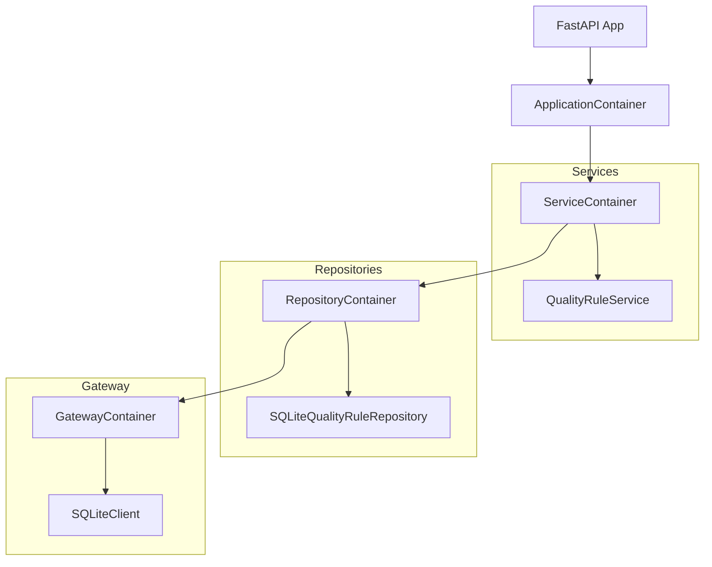

# DataConduit-API

DataConduit-API is a lightweight, modular FastAPI service designed to manage data quality rules for tables and columns. It implements a clean architecture with a clear separation of concerns, making it highly maintainable and extensible.

## 🚀 Overview

The service allows users to define, manage, and query quality rules (such as uniqueness, range, regex, and enum) that are applied to specific target tables and columns. It leverages modern Python tools to ensure a robust and developer-friendly experience.

### Key Features:
- **CRUD Operations**: Full support for creating, reading, updating, and (soft) deleting quality rules.
- **Rule Types**:
    - `unicity`: Ensures data uniqueness in a column.
    - `precision`: Validates numeric ranges (`min_value`/`max_value`) or allowed sets of values (`enum_value`).
    - `validity`: Validates data against a specific regular expression (`regex_expr`).
    - `completeness`: Checks for the presence of data.
- **Soft Delete**: Rules can be deactivated and reactivated without being permanently removed from the database.
- **Dependency Injection**: Fully decoupled components using the `dependency-injector` library.
- **Data Validation**: Strict request/response validation using Pydantic schemas, including cross-field validation for rule parameters.

## 🏗️ Architecture

The project follows a layered architecture inspired by Clean Architecture principles:

1.  **Controllers (API Layer)**: FastAPI routers that handle HTTP requests, validate input using Pydantic, and map domain exceptions to appropriate HTTP responses.
2.  **Services (Business Logic)**: Orchestrate business rules and interact with repositories. This layer is independent of the framework and database.
3.  **Repositories (Data Access)**: Handle persistence logic using SQLAlchemy. Interfaces are used to decouple the service layer from specific database implementations.
4.  **Gateway (Infrastructure)**: Provides the database client and base configuration.
5.  **Models & Schemas**: 
    - **Models**: SQLAlchemy declarative models for database persistence.
    - **Schemas**: Pydantic models for data validation, serialization, and API documentation.

### Dependency Injection Diagram



## 🛠️ Technologies

- **Python 3.14+**
- **FastAPI**: Modern, fast web framework for building APIs.
- **SQLAlchemy 2.0**: Powerful SQL toolkit and Object Relational Mapper.
- **Dependency-Injector**: Professional dependency injection framework.
- **Pydantic**: Data validation and settings management.
- **SQLite**: Default lightweight database engine.
- **Uvicorn**: Lightning-fast ASGI server implementation.

## 📦 Installation & Setup

### 1. Clone the repository
```bash
git clone https://github.com/your-repo/DataConduit-API.git
cd DataConduit-API
```

### 2. Create and activate a virtual environment
```bash
python -m venv .venv
source .venv/bin/activate  # On Windows: .venv\Scripts\activate
```

### 3. Install dependencies
```bash
pip install -r requirements.txt
```

### 4. Initialize the Database
Before running the application for the first time, initialize the SQLite database:
```bash
python db/init_db.py
```

## 🚦 Running the Application

Start the development server with auto-reload:
```bash
uvicorn src.app:app --reload
```
The API will be available at `http://127.0.0.1:8000`.

### API Documentation
Access the interactive Swagger UI at: `http://127.0.0.1:8000/docs`

## 📖 Usage Guide

### Rule Data Model

A Quality Rule consists of the following fields:
- `rule_type`: Type of rule (`unicity`, `precision`, `validity`, `completeness`).
- `target_table`: The table name the rule applies to.
- `target_column`: The specific column in the table.
- `min_value` / `max_value`: Numeric bounds (required for `precision` if `enum_value` is not provided).
- `enum_value`: List of allowed values (required for `precision` if `min/max` are not provided).
- `regex_expr`: Regular expression (required for `validity`).
- `is_active`: Boolean flag for soft deletion.

### Example API Calls

#### Create a Rule (Precision with Range)
```bash
curl -X 'POST' \
  'http://127.0.0.1:8000/api/v1/rule' \
  -H 'accept: application/json' \
  -H 'Content-Type: application/json' \
  -d '{
  "rule_type": "precision",
  "target_table": "orders",
  "target_column": "amount",
  "min_value": 0,
  "max_value": 10000
}'
```

#### Create a Rule (Validity with Regex)
```bash
curl -X 'POST' \
  'http://127.0.0.1:8000/api/v1/rule' \
  -H 'accept: application/json' \
  -H 'Content-Type: application/json' \
  -d '{
  "rule_type": "validity",
  "target_table": "users",
  "target_column": "email",
  "regex_expr": "^[a-zA-Z0-9._%+-]+@[a-zA-Z0-9.-]+\\.[a-zA-Z]{2,}$"
}'
```

#### Get Rules by Table
```bash
curl 'http://127.0.0.1:8000/api/v1/rule/table/orders?is_active=true'
```

#### Deactivate a Rule (Soft Delete)
```bash
curl -X 'PATCH' \
  'http://127.0.0.1:8000/api/v1/rule/1' \
  -H 'Content-Type: application/json' \
  -d '{"is_active": false}'
```

## 📂 Project Structure

```text
DataConduit-API/
├── db/                 # Database initialization and storage
├── infra/              # Infrastructure-related configs
├── src/
│   ├── config/         # DI Container and app configuration
│   ├── controller/     # API Endpoints (v1)
│   ├── exceptions/     # Custom domain and repo exceptions
│   ├── gateway/        # DB Clients
│   ├── model/          # SQLAlchemy Models
│   ├── repository/     # Data access layer (Interfaces + Impl)
│   ├── schema/         # Pydantic Schemas
│   ├── service/        # Business logic layer (Interfaces + Impl)
│   └── app.py          # Application entry point
└── test/               # Test suites (Scenario-based)
```

## 🧪 Testing

The project uses a BDD approach for scenario definitions.
- Feature files are located in `test/scenario/`.
- Future improvements include implementing step definitions and unit tests for services and repositories.

## 🤝 Contributing

1. Fork the Project
2. Create your Feature Branch (`git checkout -b feature/AmazingFeature`)
3. Commit your Changes (`git commit -m 'Add some AmazingFeature'`)
4. Push to the Branch (`git push origin feature/AmazingFeature`)
5. Open a Pull Request
